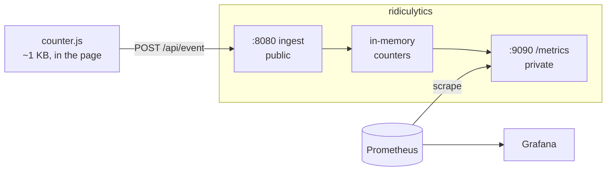

# ridiculytics

[](https://github.com/fjaeckel/ridiculytics/actions/workflows/ci.yml)
[](https://goreportcard.com/report/github.com/fjaeckel/ridiculytics)
[](LICENSE)

Privacy-first web analytics that stores nothing and speaks Prometheus.

One ~15 MB Go binary. No database, no disk writes, no cookies, no persistent
identifiers. A 1 KB script posts events, they land in bounded in-memory
counters, and they leave as Prometheus metrics. Your TSDB is the storage layer
and Grafana is the dashboard — neither is something extra to run if you already
have monitoring.

Free forever, and structurally so: no hosted tier, no paid build, nothing
behind a licence check.



## Quick start

```sh
docker compose -f docker-compose.e2e.yml up
```

Ridiculytics, Prometheus and Grafana with a provisioned dashboard, on `:8080`,
`:9091` and `:3000`. Local only — no TLS, no auth.

Add to your site:

```html
<script defer
        src="https://cdn.jsdelivr.net/npm/ridiculytics@1/web/counter.min.js"
        data-host="https://stats.example.com"
        data-site="example.com"></script>
```

`data-host` is mandatory and there is no fallback endpoint in the source, so a
fork that forgets it is a silent no-op rather than a script quietly reporting
to somebody else's server.

For a real deployment — ridiculytics + nginx + optional certbot, configured
entirely through environment variables — see **[docs/deployment.md](docs/deployment.md)**.

## Two things to know before you adopt it

**It stores marginals, not a cube.** Each dimension gets its own metric family
carrying at most two labels: its own, plus `path`. You can slice any dimension
*by page* — the correlation people actually ask for. You cannot slice by
anything else, and there are no three-way slices. That trade is what keeps
series counts linear instead of multiplicative, and it is permanent.

**Unique visitors come from sketches, and sketches do not merge.** Uniques
exist only for the windows the server computes (`1h`, `24h`, `7d`, `30d`).
Prometheus cannot merge HyperLogLog sketches, so uniques over an arbitrary
range are not derivable. A rotating in-memory salt means no IP is ever stored
or exported.

Both are inherent to in-memory plus Prometheus, not gaps to close later. If you
need free n-way slicing or funnels, you want an event store and a columnar
database — a different project with a very different operational cost.

What you get in exchange is the reason this exists: analytics in the same TSDB
as your infrastructure metrics. Pageviews and p99 latency on one Grafana row.
An Alertmanager rule that fires when a deploy takes traffic to zero.

## Documentation

| | |
|---|---|
| [Deployment](docs/deployment.md) | Production stack, TLS, ports, GeoIP, abuse resistance |
| [Configuration](docs/configuration.md) | Every environment variable, per-site overrides, YAML |
| [Metrics](docs/metrics.md) | Metric families, label sentinels, PromQL recipes |
| [Cardinality](docs/cardinality.md) | The one knob that decides your series count |
| [Contributing](CONTRIBUTING.md) | Tests, releases, project layout |

## Privacy

No cookies, no localStorage, no fingerprinting, no cross-site identifier. The
visitor hash is salted with a rotating in-memory secret and is not linkable
across sites or across rotations. Referrers are reduced to a bare host. IP
addresses live for the duration of one request handler and are never stored,
logged, or exported.

This is the usual basis for arguing no cookie banner is required. It is not
legal advice, and your regulator is not us.

## Licence

`web/counter.js` is **MIT** — it gets embedded in other people's pages, where
anything copyleft would be a non-starter. Everything else is **AGPL-3.0**,
which is the licence that stops someone wrapping this in a closed hosted
product.
