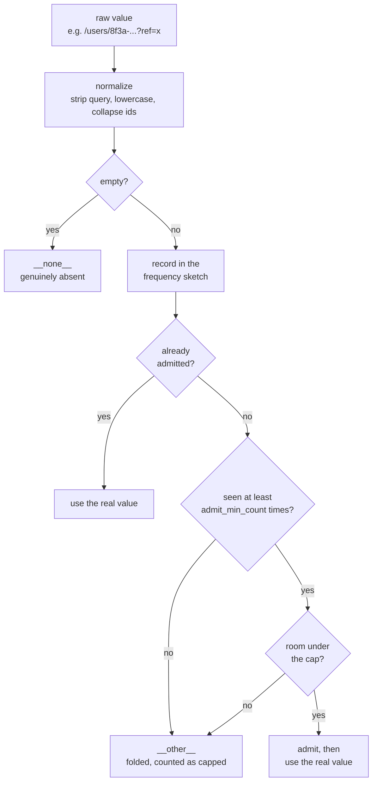

# Cardinality

A public ingest endpoint with user-controlled label values is a cardinality
bomb pointed at your own monitoring stack. This is the part of the design that
decides whether it survives contact with the internet.

## The knob

`cross_path_cap` governs `path` used as a secondary label, and spans a 30x
range in series count. Approximate, per site:

| `cross_path_cap` | series/site | 100 sites |
|---|---|---|
| path labels off | ~900 | ~90k |
| 50 (default) | ~8,300 | ~830k |
| 200 | ~28,000 | ~2.8M |

Traffic is Zipfian, so the top 50 paths are usually 90%+ of pageviews — the
default keeps nearly all the analytical value at a third of the cost.
`path_cap` (default 200) separately governs the dedicated `pageviews_total`
family, which is one label deep and therefore cheap.

## How a label value is decided



Bounded dimensions skip the frequency check entirely — see below.

## Defences

1. **Path normalization.** Query strings and fragments dropped, lowercased,
   trailing slash stripped, UUIDs and long hex and long digit runs collapsed to
   `:id`. Four-digit years survive, because `/2024/review` is a route.
2. **Frequency-based admission.** A value must be seen `admit_min_count` times
   before it earns a series. A naive "first N win" cap would let one crawler
   squat every slot in the first second; here real traffic wins and noise stays
   folded into `__other__`.
3. **Split caps.** `path_cap` for the dedicated family, `cross_path_cap` for
   path as a secondary label.
4. **Decay.** Values unseen for `decay_after` are dropped and their series
   deleted, so a site's metric shape follows its current traffic rather than
   freezing on whatever it looked like at boot.

Dimensions with a closed value space — browser, OS, device, screen, country —
skip the frequency gate and are admitted on first sight. Nothing a client sends
can invent a new value there, so gating them would only mean a quiet site
reports `__other__` until its third pageview.

## Why marginals stay exact

**Overflow is applied per dimension, independently.** Path folds on the path
frequency sketch, country on the country sketch. So `sum by (country)` and
`sum by (path)` are true totals no matter how much folding happened — only the
individual cell (`/pricing` × `DE`) can be lossy.

Path admission is **global**, decided once by a shared frequency sketch for
every ⊕ family at once. Per-family admission would let `/a` be tracked in
`by_country` but folded in `by_device`, so the families would disagree about
which paths exist — confusing to query and pointless to compute.

There is a test for exactly this, because if it breaks, every dashboard built
on this quietly starts lying:

```sh
make test-cardinality
```

## Flood resistance

The admission sketch uses conservative update and periodic halving, so a flood
of unique values cannot raise the noise floor until everything looks frequent.
Measured leakage into a 200-slot cap, with a real path still admitted in every
case:

| unique values flooded | slots leaked |
|---|---|
| 5,000 | 0 |
| 50,000 | 1 |
| 500,000 | 1 |
| 2,000,000 | 9 |

It degrades gradually and never locks out genuine traffic. A plain
non-conservative, non-aged sketch lost 10 slots to only 5,000 values *and* then
refused the real path outright.

## Watching it

```promql
# share of pageviews being folded — if this climbs, your breakdowns are
# increasingly showing __other__ instead of real values
sum by (dimension) (rate(ridiculytics_cardinality_capped_total[30m]))
  / sum(rate(ridiculytics_pageviews_total[30m]))

# how full each cap is
ridiculytics_label_values

# total series this collector is responsible for
count({__name__=~"ridiculytics_.*"})
```

When the folded share climbs, raise `cross_path_cap` or add a `path_rewrite`.
`deploy/rules.yml` ships a `CardinalityCapBiting` alert at 30%.
