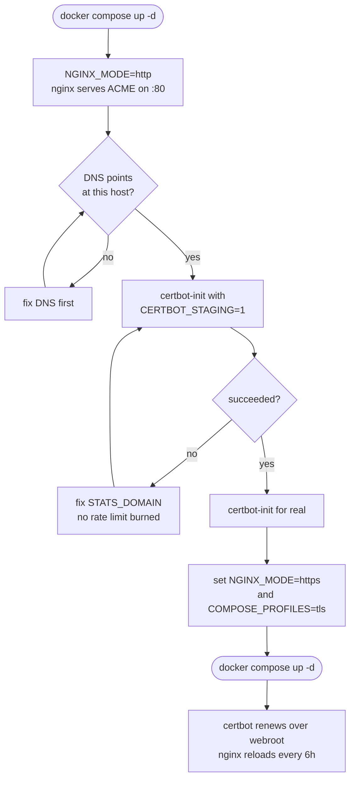

# Deployment

The production stack is three services: **ridiculytics + nginx + certbot**,
and certbot only runs if you enable it. There is no Prometheus or Grafana here
— scrape the metrics port from your existing monitoring.

```sh
cp .env.example .env
$EDITOR .env                     # STATS_DOMAIN, CERTBOT_EMAIL, RIDICULYTICS_SITES
docker compose -f docker-compose.prod.yml up -d
```

## TLS

TLS is opt-in and controlled by two variables that move together:

```sh
COMPOSE_PROFILES=tls   # runs certbot: issuance + renewal loop
NGINX_MODE=https       # nginx serves TLS and redirects HTTP
```

Order matters. In `https` mode nginx refuses to start without a real
certificate, so issue one while still in the default `http` mode:



```sh
# 1. bring the stack up in http mode, point DNS at this host
docker compose -f docker-compose.prod.yml up -d

# 2. issue. Use staging first — Let's Encrypt allows 5 failures per hostname
#    per hour, and a typo in STATS_DOMAIN burns one.
CERTBOT_STAGING=1 COMPOSE_PROFILES=tls \
  docker compose -f docker-compose.prod.yml run --rm certbot-init
COMPOSE_PROFILES=tls \
  docker compose -f docker-compose.prod.yml run --rm certbot-init

# 3. set both variables in .env, then bring it up again
docker compose -f docker-compose.prod.yml up -d
```

Renewal is automatic. Certbot renews over the ACME webroot, so nginx never goes
down and certbot never binds a port. nginx reloads every 6h to pick up a
renewed certificate.

Leaving TLS off is a legitimate end state if something in front already
terminates it — a cloud load balancer, Cloudflare, an existing edge proxy.
Otherwise do not serve public traffic in `http` mode: beacons travel in
cleartext, and HTTPS pages will block `counter.js` as mixed content.

## Ports

| port | binding | serves |
|---|---|---|
| 80 | public | ACME challenges, redirect to HTTPS |
| 443 | public | `/api/event`, `/counter.js`, `/api/health` — everything else 404s |
| 9090 | `127.0.0.1` only | `/metrics`, for a Prometheus on the same host |

`/metrics` is **never** proxied through nginx. It has no authentication by
design; publishing it hands your whole dataset to the internet. Point
Prometheus at `127.0.0.1:9090`, or attach it to the compose network.

`RIDICULYTICS_TRUST_PROXY=true` is set for you and is mandatory behind nginx.
Without it every visitor appears to originate from the nginx container:
geolocation and ASN are wrong for everyone, and the per-/24 rate limiter
throttles your entire audience as though it were one client.

## GeoIP

MaxMind GeoLite2 is free of charge but not free: it needs an account and a
licence key, its EULA forbids redistribution, and the terms have already been
tightened twice — mandatory registration in December 2019, a further
redistribution clause in 2022. Nothing here depends on it.

| provider | licence | ships in the image | notes |
|---|---|---|---|
| **DB-IP Lite** | CC-BY-4.0 | yes | recommended default, no signup |
| MaxMind GeoLite2 | proprietary | no | more accurate, needs a licence key |
| `none` | — | — | fully supported; geo families go absent |

```sh
WITH_GEO=1                      # bake DB-IP Lite into the image at build time
RIDICULYTICS_GEO_PROVIDER=dbip
RIDICULYTICS_GEO_CITY_DB=/var/lib/ridiculytics/dbip-city-lite.mmdb
RIDICULYTICS_GEO_ASN_DB=/var/lib/ridiculytics/dbip-asn-lite.mmdb
```

DB-IP Lite's licence requires attribution — link db-ip.com in your docs.

Alert on `ridiculytics_geoip_db_age_seconds`: stale geo is silent geo, since
lookups increasingly miss and fall into `__none__`.

## Abuse resistance

The endpoint is public and unauthenticated, so everything it receives is
treated as hostile:

- **Origin allowlist per site.** The primary gate. It does not stop a
  determined `curl`, but it stops every accidental and casual case. A site with
  an empty allowlist is rejected at startup rather than accepting everything.
- **Optional HMAC** per site, off by default — the key is client-visible
  anyway, so it raises cost, not impossibility.
- **Token-bucket rate limiting** per IPv4 /24 and IPv6 /64, failing closed when
  the tracking map is full.
- **4 KB body cap**, strict JSON with unknown fields rejected, every string
  length-bounded before it can become a label.
- **Bot filtering that is counted, not silent** — `result="bot"` on
  `ingest_events_total`. Silent drops are how you spend a Saturday debugging
  traffic that never arrives.
- **X-Forwarded-For is ignored unless `trust_proxy` is set.** Trusting it by
  default would let anyone forge their own geolocation and rotate a header to
  evade rate limiting.

Ingest answers immediately and aggregates asynchronously through a bounded
queue. A slow GeoIP lookup or a full queue must never become browser latency on
somebody else's site.

## Alerting

[`deploy/rules.yml`](../deploy/rules.yml) ships rules for traffic stopping,
traffic spiking, the cardinality cap biting, ingest backlog, dropped events and
a stale GeoIP database. Traffic alerting is the thing hosted analytics
dashboards are worst at and Prometheus is best at.
